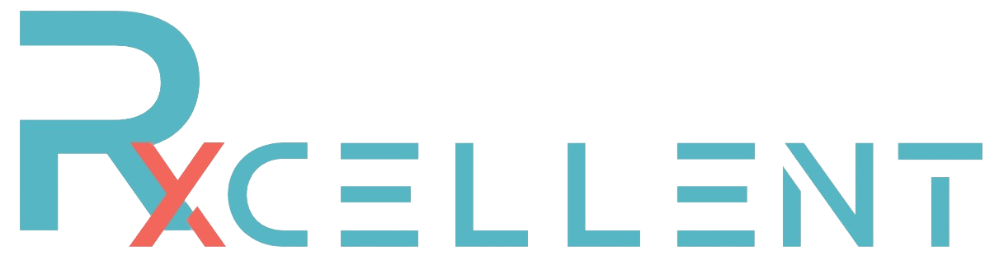

    
     

# \<Rxcellent\>

Please give a brief description about your project here.

Team 4 set out to build a pharmacy e-commerce application where a user could receive and refill their prescriptions without the need to log in and have the option to shop for other items commonly found in a pharmacy.

## Technology Stack

Please specify the technology stack used.

Frontend: HTML, CSS, JavaScript, TypeScript, React.js
Backend: Node.js, Express.js, MongoDB
Middleware: Postman
Testing: Vitest

## A list of Completed Features

Pleaea list all features implemented (from users' pointview) and a brief description of each feature and related screenshots if applies.
Also provide a link to your requirement management tool such as pivotaltracker or Jira.

## Development Configuration Instructions

Please describe how to set up the local development environment and how to build/run the project.

-   (If you haven't already cloned the repo) `git clone https://github.com/BUMETCS673/group-project-team4-js.git`
-   (If you have the repo on your machine, go to your project folder and) `git fetch`
-   `git checkout devel`
-   (In project root directory) `npm install`
-   (In project "rxcellent-be" directory) `npm install`
-   (In project "rxcellent-fe" directory) `npm install`
-   (In project "rxcellent-be" directory) `npm run start` to run backend server
-   (In project "rxcellent-fe" directory) `npm run dev` to run frontend server
-   Go to url: `localhost:5673`

# Rxcellent-Backend

## run project

-   `npm run start`

## debug project

-   `npm run debug`

## test project

-   `npm run test`
-   `npm run coverage`

Project documents included in frontend release

# Rxcellent-Frontend

## run project

-   `npm run dev`
-   url: `localhost:5673`

## Deployment (if applied)

If the app is deployed on a remote server, please provide a link to the deployed app.

Also describe how the app is deployed.

## Team members

Team member names and each member's contribution

Ryan Burns - Team Leader - My main focus was on the front-end I implemented the category section on the landing page and worked on (but Christol and Zahit completed) the searchbar and the shopping cart. I added over 100 documents to our Databasse that would allow our team to populate the shopping page with products.
